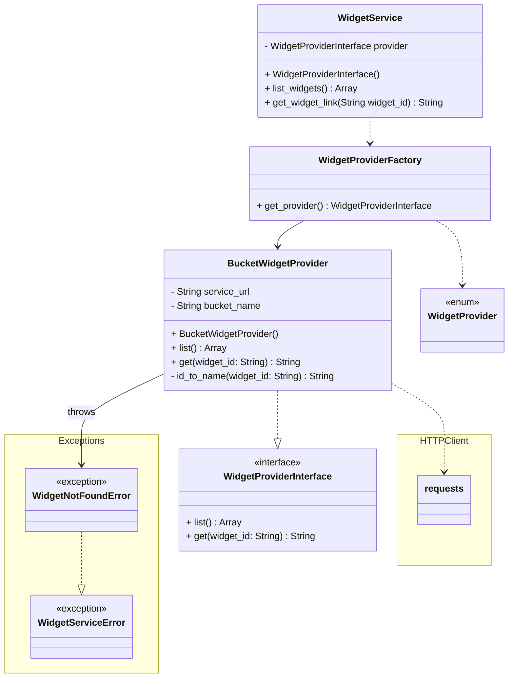

```mermaid
classDiagram
    class WidgetService {
        - WidgetProviderInterface provider
        + WidgetProviderInterface()
        + list_widgets() Array
        + get_widget_link(String widget_id) String
    }

    class WidgetProviderFactory {
        + get_provider() WidgetProviderInterface
    }

    class WidgetProviderInterface {
        <<interface>>
        + list() Array
        + get(widget_id: String) String
    }

    class BucketWidgetProvider {
        - String service_url
        - String bucket_name
        + BucketWidgetProvider()
        + list() Array
        + get(widget_id: String) String
        - id_to_name(widget_id: String) String
    }

    class WidgetProvider {
        <<enum>>
    }

    namespace Exceptions {
        class WidgetServiceError {
            <<exception>>
        }
        
        class WidgetNotFoundError {
            <<exception>>
        }
    }
    
    namespace HTTPClient {
        class requests
    }

    BucketWidgetProvider ..|> WidgetProviderInterface

    WidgetService ..> WidgetProviderFactory

    WidgetProviderFactory --> BucketWidgetProvider
    WidgetProviderFactory ..> WidgetProvider

    WidgetNotFoundError ..|> WidgetServiceError

    BucketWidgetProvider --> WidgetNotFoundError : throws

    BucketWidgetProvider ..> requests
```